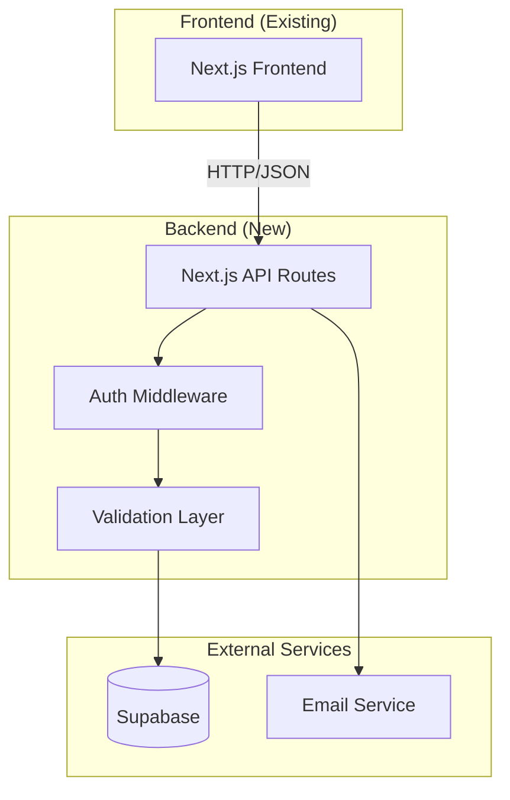

# Design Document

## Overview

This design document outlines the architecture for a complete backend system for a food delivery platform operating in Switzerland. The backend will be built using Next.js 15 API routes with TypeScript, Supabase for database and authentication, and Stripe for payment processing. The design ensures zero frontend changes by matching existing data structures and API contracts.

### Technology Stack

- **Runtime**: Next.js 15 API Routes (App Router)
- **Language**: TypeScript
- **Database**: Supabase (PostgreSQL)
- **Authentication**: Supabase Auth with JWT
- **File Storage**: Supabase Storage
- **Payment**: To be integrated later (placeholder for future Stripe/other gateway)
- **Email**: Supabase Email (with potential for SendGrid/Resend)
- **Validation**: Zod
- **ORM**: Prisma (optional) or Supabase JS Client

### Design Principles

1. **Frontend Compatibility**: All API responses match existing frontend data structures
2. **Role-Based Access Control**: Strict permission enforcement at API level
3. **Multi-tenancy**: Restaurant owners manage only their data
4. **Scalability**: Stateless API design with database connection pooling
5. **Security**: Input validation, SQL injection prevention, rate limiting
6. **Localization**: Multi-language support for content and notifications

## Architecture

### High-Level Architecture



### API Route Structure


```
app/api/
├── auth/
│   ├── register/route.ts
│   ├── login/route.ts
│   ├── logout/route.ts
│   ├── refresh/route.ts
│   └── reset-password/route.ts
├── restaurants/
│   ├── route.ts (GET all, POST create)
│   ├── [id]/route.ts (GET, PATCH, DELETE)
│   ├── [id]/menu/route.ts
│   ├── [id]/menu/[itemId]/route.ts
│   └── search/route.ts
├── orders/
│   ├── route.ts (GET all, POST create)
│   ├── [id]/route.ts (GET, PATCH)
│   ├── [id]/status/route.ts
│   └── customer/[customerId]/route.ts
├── drivers/
│   ├── route.ts (GET all, POST register)
│   ├── [id]/route.ts (GET, PATCH)
│   ├── [id]/orders/route.ts
│   └── available-orders/route.ts
├── customers/
│   ├── route.ts (GET all)
│   ├── [id]/route.ts (GET, PATCH, DELETE)
│   ├── [id]/orders/route.ts
│   ├── [id]/favorites/route.ts
│   └── [id]/loyalty/route.ts
├── admin/
│   ├── restaurants/approve/route.ts
│   ├── drivers/approve/route.ts
│   ├── analytics/route.ts
│   └── settings/route.ts
└── uploads/
    └── route.ts
```

## Components and Interfaces

### 1. Authentication System

#### User Roles
- `CUSTOMER`: Regular users who order food
- `RESTAURANT_OWNER`: Restaurant administrators
- `DRIVER`: Delivery personnel
- `SUPER_ADMIN`: Platform administrators

#### JWT Token Structure
```typescript
interface JWTPayload {
  userId: string;
  email: string;
  role: UserRole;
  restaurantId?: string; // For restaurant owners
  driverId?: string; // For drivers
  iat: number;
  exp: number;
}
```

#### Authentication Middleware
```typescript
// Validates JWT and attaches user to request
async function authMiddleware(req: NextRequest): Promise<AuthUser | null>

// Role-based access control
function requireRole(roles: UserRole[]): Middleware
```

### 2. Database Schema

#### Core Tables

**users**
```sql
CREATE TABLE users (
  id UUID PRIMARY KEY DEFAULT uuid_generate_v4(),
  email VARCHAR(255) UNIQUE NOT NULL,
  password_hash VARCHAR(255) NOT NULL,
  role VARCHAR(50) NOT NULL,
  first_name VARCHAR(100),
  last_name VARCHAR(100),
  phone VARCHAR(20),
  language VARCHAR(5) DEFAULT 'en',
  status VARCHAR(20) DEFAULT 'active',
  created_at TIMESTAMP DEFAULT NOW(),
  updated_at TIMESTAMP DEFAULT NOW()
);
```

**restaurants**
```sql
CREATE TABLE restaurants (
  id UUID PRIMARY KEY DEFAULT uuid_generate_v4(),
  owner_id UUID REFERENCES users(id),
  name VARCHAR(255) NOT NULL,
  description TEXT,
  cuisine_types VARCHAR(100)[], -- e.g., ['Ethiopian', 'Kenyan']
  address TEXT NOT NULL,
  city VARCHAR(100) NOT NULL,
  postal_code VARCHAR(20) NOT NULL,
  region VARCHAR(50) NOT NULL, -- Basel, Bern, Luzern, Zürich
  latitude DECIMAL(10, 8),
  longitude DECIMAL(11, 8),
  phone VARCHAR(20),
  email VARCHAR(255),
  min_order_amount DECIMAL(10, 2) DEFAULT 24.00,
  status VARCHAR(20) DEFAULT 'pending', -- pending, active, suspended
  rating DECIMAL(3, 2) DEFAULT 0.00,
  total_ratings INTEGER DEFAULT 0,
  logo_url TEXT,
  cover_image_url TEXT,
  opening_hours JSONB, -- {monday: {open: '10:00', close: '22:00'}, ...}
  created_at TIMESTAMP DEFAULT NOW(),
  updated_at TIMESTAMP DEFAULT NOW()
);
```

**menu_items**
```sql
CREATE TABLE menu_items (
  id UUID PRIMARY KEY DEFAULT uuid_generate_v4(),
  restaurant_id UUID REFERENCES restaurants(id) ON DELETE CASCADE,
  name VARCHAR(255) NOT NULL,
  description TEXT,
  price DECIMAL(10, 2) NOT NULL,
  category VARCHAR(50) NOT NULL, -- meals, drinks, special_deals
  meal_category VARCHAR(50), -- main_dishes, appetizers, desserts
  cuisine_type VARCHAR(50),
  dietary_tags VARCHAR(50)[], -- ['vegan', 'vegetarian', 'gluten_free']
  image_url TEXT,
  gallery_urls TEXT[],
  quantity INTEGER DEFAULT 0,
  status VARCHAR(20) DEFAULT 'active', -- active, inactive, out_of_stock
  translations JSONB, -- {de: {name: '', description: ''}, fr: {...}}
  created_at TIMESTAMP DEFAULT NOW(),
  updated_at TIMESTAMP DEFAULT NOW()
);
```

**orders**
```sql
CREATE TABLE orders (
  id UUID PRIMARY KEY DEFAULT uuid_generate_v4(),
  order_number VARCHAR(50) UNIQUE NOT NULL,
  customer_id UUID REFERENCES users(id),
  restaurant_id UUID REFERENCES restaurants(id),
  driver_id UUID REFERENCES drivers(id),
  status VARCHAR(50) NOT NULL DEFAULT 'new',
  -- new, confirmed, preparing, ready_for_pickup, assigned, in_transit, delivered, cancelled
  
  -- Customer details (for guest orders)
  customer_email VARCHAR(255),
  customer_phone VARCHAR(20),
  customer_first_name VARCHAR(100),
  customer_last_name VARCHAR(100),
  
  -- Delivery details
  delivery_address TEXT NOT NULL,
  delivery_city VARCHAR(100) NOT NULL,
  delivery_postal_code VARCHAR(20) NOT NULL,
  delivery_latitude DECIMAL(10, 8),
  delivery_longitude DECIMAL(11, 8),
  delivery_instructions TEXT,
  scheduled_delivery_time TIMESTAMP,
  actual_delivery_time TIMESTAMP,
  
  -- Pricing
  subtotal DECIMAL(10, 2) NOT NULL,
  delivery_fee DECIMAL(10, 2) NOT NULL,
  discount_amount DECIMAL(10, 2) DEFAULT 0.00,
  tax_amount DECIMAL(10, 2) DEFAULT 0.00,
  total_amount DECIMAL(10, 2) NOT NULL,
  
  -- Payment (placeholder for future integration)
  payment_status VARCHAR(50) DEFAULT 'pending',
  payment_method VARCHAR(50),
  payment_reference VARCHAR(255), -- For future payment gateway reference
  voucher_code VARCHAR(50),
  
  created_at TIMESTAMP DEFAULT NOW(),
  updated_at TIMESTAMP DEFAULT NOW()
);
```

**order_items**
```sql
CREATE TABLE order_items (
  id UUID PRIMARY KEY DEFAULT uuid_generate_v4(),
  order_id UUID REFERENCES orders(id) ON DELETE CASCADE,
  menu_item_id UUID REFERENCES menu_items(id),
  name VARCHAR(255) NOT NULL, -- Snapshot at order time
  price DECIMAL(10, 2) NOT NULL,
  quantity INTEGER NOT NULL,
  subtotal DECIMAL(10, 2) NOT NULL,
  special_instructions TEXT,
  created_at TIMESTAMP DEFAULT NOW()
);
```

**drivers**
```sql
CREATE TABLE drivers (
  id UUID PRIMARY KEY DEFAULT uuid_generate_v4(),
  user_id UUID REFERENCES users(id),
  license_number VARCHAR(100),
  vehicle_type VARCHAR(50),
  vehicle_plate VARCHAR(50),
  pickup_zone VARCHAR(50) NOT NULL, -- Basel, Bern, Luzern, Zürich
  status VARCHAR(20) DEFAULT 'pending', -- pending, active, inactive, suspended
  rating DECIMAL(3, 2) DEFAULT 0.00,
  total_ratings INTEGER DEFAULT 0,
  total_deliveries INTEGER DEFAULT 0,
  total_earnings DECIMAL(10, 2) DEFAULT 0.00,
  profile_image_url TEXT,
  documents_verified BOOLEAN DEFAULT FALSE,
  created_at TIMESTAMP DEFAULT NOW(),
  updated_at TIMESTAMP DEFAULT NOW()
);
```


**loyalty_points**
```sql
CREATE TABLE loyalty_points (
  id UUID PRIMARY KEY DEFAULT uuid_generate_v4(),
  customer_id UUID REFERENCES users(id),
  points_balance INTEGER DEFAULT 0,
  lifetime_points INTEGER DEFAULT 0,
  referral_code VARCHAR(50) UNIQUE,
  created_at TIMESTAMP DEFAULT NOW(),
  updated_at TIMESTAMP DEFAULT NOW()
);
```

**loyalty_transactions**
```sql
CREATE TABLE loyalty_transactions (
  id UUID PRIMARY KEY DEFAULT uuid_generate_v4(),
  customer_id UUID REFERENCES users(id),
  order_id UUID REFERENCES orders(id),
  transaction_type VARCHAR(50) NOT NULL, -- earned, redeemed, referral_bonus
  points INTEGER NOT NULL,
  description TEXT,
  created_at TIMESTAMP DEFAULT NOW()
);
```

**vouchers**
```sql
CREATE TABLE vouchers (
  id UUID PRIMARY KEY DEFAULT uuid_generate_v4(),
  code VARCHAR(50) UNIQUE NOT NULL,
  discount_type VARCHAR(20) NOT NULL, -- percentage, fixed_amount
  discount_value DECIMAL(10, 2) NOT NULL,
  min_order_amount DECIMAL(10, 2),
  max_discount_amount DECIMAL(10, 2),
  usage_limit INTEGER,
  usage_count INTEGER DEFAULT 0,
  valid_from TIMESTAMP,
  valid_until TIMESTAMP,
  status VARCHAR(20) DEFAULT 'active',
  created_at TIMESTAMP DEFAULT NOW()
);
```

**favorites**
```sql
CREATE TABLE favorites (
  id UUID PRIMARY KEY DEFAULT uuid_generate_v4(),
  customer_id UUID REFERENCES users(id),
  menu_item_id UUID REFERENCES menu_items(id),
  created_at TIMESTAMP DEFAULT NOW(),
  UNIQUE(customer_id, menu_item_id)
);
```

**notifications**
```sql
CREATE TABLE notifications (
  id UUID PRIMARY KEY DEFAULT uuid_generate_v4(),
  user_id UUID REFERENCES users(id),
  type VARCHAR(50) NOT NULL,
  title VARCHAR(255) NOT NULL,
  message TEXT NOT NULL,
  data JSONB,
  read BOOLEAN DEFAULT FALSE,
  created_at TIMESTAMP DEFAULT NOW()
);
```

**activity_logs**
```sql
CREATE TABLE activity_logs (
  id UUID PRIMARY KEY DEFAULT uuid_generate_v4(),
  user_id UUID REFERENCES users(id),
  entity_type VARCHAR(50) NOT NULL, -- restaurant, driver, order
  entity_id UUID,
  action VARCHAR(100) NOT NULL,
  details JSONB,
  ip_address VARCHAR(45),
  created_at TIMESTAMP DEFAULT NOW()
);
```


### 3. API Endpoints Design

#### Authentication Endpoints

**POST /api/auth/register**
```typescript
Request: {
  email: string;
  password: string;
  firstName: string;
  lastName: string;
  phone?: string;
  role: 'customer' | 'restaurant_owner' | 'driver';
  language?: 'en' | 'de' | 'fr' | 'it';
}

Response: {
  user: {
    id: string;
    email: string;
    firstName: string;
    lastName: string;
    role: string;
  };
  token: string;
  refreshToken: string;
}
```

**POST /api/auth/login**
```typescript
Request: {
  email: string;
  password: string;
}

Response: {
  user: {
    id: string;
    email: string;
    firstName: string;
    lastName: string;
    role: string;
    restaurantId?: string;
    driverId?: string;
  };
  token: string;
  refreshToken: string;
}
```

#### Restaurant Endpoints

**GET /api/restaurants**
```typescript
Query Parameters: {
  city?: string;
  region?: string;
  cuisineType?: string;
  minPrice?: number;
  maxPrice?: number;
  search?: string;
  sortBy?: 'distance' | 'rating' | 'name';
  latitude?: number;
  longitude?: number;
  page?: number;
  limit?: number;
}

Response: {
  restaurants: Array<{
    id: string;
    name: string;
    cuisine: string; // Comma-separated for frontend
    distance: string; // "9 km, 47 min from Olten"
    minPrice: number;
    rating: number;
    logoUrl?: string;
    coverImageUrl?: string;
    status: string;
  }>;
  total: number;
  page: number;
  totalPages: number;
}
```

**GET /api/restaurants/[id]**
```typescript
Response: {
  id: string;
  name: string;
  description: string;
  cuisineTypes: string[];
  address: string;
  city: string;
  postalCode: string;
  region: string;
  phone: string;
  email: string;
  minOrderAmount: number;
  rating: number;
  totalRatings: number;
  logoUrl: string;
  coverImageUrl: string;
  openingHours: Record<string, {open: string; close: string}>;
}
```

**GET /api/restaurants/[id]/menu**
```typescript
Query Parameters: {
  category?: 'meals' | 'drinks' | 'special_deals';
  dietaryTag?: string;
  sortBy?: 'price' | 'name';
}

Response: {
  items: Array<{
    id: string;
    name: string;
    description: string;
    price: number;
    category: string;
    mealCategory?: string;
    cuisineType?: string;
    dietaryTags: string[];
    imageUrl?: string;
    galleryUrls: string[];
    quantity: number;
    status: string;
  }>;
}
```


**POST /api/restaurants/[id]/menu**
```typescript
Request: {
  name: string;
  description: string;
  price: number;
  category: 'meals' | 'drinks' | 'special_deals';
  mealCategory?: string;
  cuisineType?: string;
  dietaryTags?: string[];
  imageUrl?: string;
  quantity: number;
  translations?: Record<string, {name: string; description: string}>;
}

Response: {
  item: MenuItem;
}
```

#### Order Endpoints

**POST /api/orders**
```typescript
Request: {
  restaurantId: string;
  customerId?: string; // Optional for guest orders
  customerEmail?: string;
  customerPhone?: string;
  customerFirstName?: string;
  customerLastName?: string;
  items: Array<{
    menuItemId: string;
    quantity: number;
    specialInstructions?: string;
  }>;
  deliveryAddress: string;
  deliveryCity: string;
  deliveryPostalCode: string;
  deliveryLatitude?: number;
  deliveryLongitude?: number;
  deliveryInstructions?: string;
  scheduledDeliveryTime: string;
  voucherCode?: string;
}

Response: {
  order: {
    id: string;
    orderNumber: string;
    status: string;
    subtotal: number;
    deliveryFee: number;
    discountAmount: number;
    taxAmount: number;
    totalAmount: number;
    paymentStatus: string; // 'pending' initially, to be updated by payment gateway later
  };
}
```

**GET /api/orders/[id]**
```typescript
Response: {
  id: string;
  orderNumber: string;
  status: string;
  restaurant: {
    id: string;
    name: string;
    address: string;
    phone: string;
  };
  customer: {
    firstName: string;
    lastName: string;
    email: string;
    phone: string;
  };
  driver?: {
    id: string;
    firstName: string;
    lastName: string;
    phone: string;
    vehicleType: string;
  };
  items: Array<{
    id: string;
    name: string;
    price: number;
    quantity: number;
    subtotal: number;
  }>;
  deliveryAddress: string;
  deliveryCity: string;
  deliveryPostalCode: string;
  scheduledDeliveryTime: string;
  actualDeliveryTime?: string;
  subtotal: number;
  deliveryFee: number;
  discountAmount: number;
  totalAmount: number;
  paymentStatus: string;
  createdAt: string;
  updatedAt: string;
}
```

**PATCH /api/orders/[id]/status**
```typescript
Request: {
  status: 'confirmed' | 'preparing' | 'ready_for_pickup' | 'assigned' | 'in_transit' | 'delivered' | 'cancelled';
  driverId?: string; // When assigning to driver
  actualDeliveryTime?: string; // When marking as delivered
}

Response: {
  order: Order;
}
```


#### Driver Endpoints

**GET /api/drivers/available-orders**
```typescript
Query Parameters: {
  pickupZone: string; // Basel, Bern, Luzern, Zürich
}

Response: {
  orders: Array<{
    id: string;
    orderNumber: string;
    restaurant: {
      name: string;
      address: string;
      city: string;
    };
    deliveryAddress: string;
    deliveryCity: string;
    scheduledDeliveryTime: string;
    totalAmount: number;
    deliveryFee: number;
  }>;
}
```

**POST /api/drivers/[id]/orders/[orderId]/accept**
```typescript
Response: {
  order: Order;
  driver: Driver;
}
```

**GET /api/drivers/[id]/orders**
```typescript
Query Parameters: {
  status?: 'assigned' | 'in_transit' | 'delivered';
  startDate?: string;
  endDate?: string;
}

Response: {
  orders: Order[];
  totalEarnings: number;
  totalDeliveries: number;
}
```

#### Customer Endpoints

**GET /api/customers/[id]/orders**
```typescript
Query Parameters: {
  status?: string;
  page?: number;
  limit?: number;
}

Response: {
  orders: Array<{
    id: string;
    orderNumber: string;
    status: string;
    restaurant: {
      name: string;
      address: string;
    };
    totalAmount: number;
    scheduledDeliveryTime: string;
    createdAt: string;
  }>;
  total: number;
}
```

**GET /api/customers/[id]/favorites**
```typescript
Response: {
  favorites: Array<{
    id: string;
    menuItem: {
      id: string;
      name: string;
      description: string;
      price: number;
      imageUrl: string;
      restaurant: {
        id: string;
        name: string;
        address: string;
      };
    };
    createdAt: string;
  }>;
}
```

**POST /api/customers/[id]/favorites**
```typescript
Request: {
  menuItemId: string;
}

Response: {
  favorite: Favorite;
}
```

**GET /api/customers/[id]/loyalty**
```typescript
Response: {
  pointsBalance: number;
  lifetimePoints: number;
  referralCode: string;
  availableRewards: Array<{
    discount: string; // "10% DISCOUNT"
    points: number;
    id: string;
  }>;
  transactions: Array<{
    id: string;
    type: string;
    points: number;
    description: string;
    createdAt: string;
  }>;
}
```

**POST /api/customers/[id]/loyalty/redeem**
```typescript
Request: {
  points: number;
  rewardType: string;
}

Response: {
  voucher: {
    code: string;
    discountType: string;
    discountValue: number;
    validUntil: string;
  };
  newBalance: number;
}
```


#### Admin Endpoints

**GET /api/admin/restaurants**
```typescript
Query Parameters: {
  status?: 'pending' | 'active' | 'suspended';
  region?: string;
  page?: number;
  limit?: number;
}

Response: {
  restaurants: Array<{
    id: string;
    name: string;
    owner: {
      firstName: string;
      lastName: string;
      email: string;
    };
    region: string;
    status: string;
    totalOrders: number;
    createdAt: string;
  }>;
  total: number;
}
```

**PATCH /api/admin/restaurants/[id]/approve**
```typescript
Request: {
  status: 'active' | 'suspended';
}

Response: {
  restaurant: Restaurant;
}
```

**GET /api/admin/analytics**
```typescript
Query Parameters: {
  startDate: string;
  endDate: string;
  region?: string;
}

Response: {
  totalOrders: number;
  totalRevenue: number;
  platformRevenue: number;
  restaurantRevenue: number;
  driverEarnings: number;
  activeCustomers: number;
  activeRestaurants: number;
  activeDrivers: number;
  averageOrderValue: number;
  ordersByStatus: Record<string, number>;
  ordersByRegion: Record<string, number>;
}
```

#### Upload Endpoints

**POST /api/uploads**
```typescript
Request: FormData with file

Response: {
  url: string;
  filename: string;
  size: number;
  mimeType: string;
}
```


## Data Models

### TypeScript Interfaces

```typescript
// User and Authentication
interface User {
  id: string;
  email: string;
  role: 'customer' | 'restaurant_owner' | 'driver' | 'super_admin';
  firstName: string;
  lastName: string;
  phone?: string;
  language: 'en' | 'de' | 'fr' | 'it';
  status: 'active' | 'inactive' | 'suspended';
  createdAt: string;
  updatedAt: string;
}

// Restaurant
interface Restaurant {
  id: string;
  ownerId: string;
  name: string;
  description: string;
  cuisineTypes: string[];
  address: string;
  city: string;
  postalCode: string;
  region: string;
  latitude?: number;
  longitude?: number;
  phone: string;
  email: string;
  minOrderAmount: number;
  status: 'pending' | 'active' | 'suspended';
  rating: number;
  totalRatings: number;
  logoUrl?: string;
  coverImageUrl?: string;
  openingHours: Record<string, {open: string; close: string}>;
  createdAt: string;
  updatedAt: string;
}

// Menu Item
interface MenuItem {
  id: string;
  restaurantId: string;
  name: string;
  description: string;
  price: number;
  category: 'meals' | 'drinks' | 'special_deals';
  mealCategory?: string;
  cuisineType?: string;
  dietaryTags: string[];
  imageUrl?: string;
  galleryUrls: string[];
  quantity: number;
  status: 'active' | 'inactive' | 'out_of_stock';
  translations?: Record<string, {name: string; description: string}>;
  createdAt: string;
  updatedAt: string;
}

// Order
interface Order {
  id: string;
  orderNumber: string;
  customerId?: string;
  restaurantId: string;
  driverId?: string;
  status: OrderStatus;
  customerEmail?: string;
  customerPhone?: string;
  customerFirstName?: string;
  customerLastName?: string;
  deliveryAddress: string;
  deliveryCity: string;
  deliveryPostalCode: string;
  deliveryLatitude?: number;
  deliveryLongitude?: number;
  deliveryInstructions?: string;
  scheduledDeliveryTime: string;
  actualDeliveryTime?: string;
  subtotal: number;
  deliveryFee: number;
  discountAmount: number;
  taxAmount: number;
  totalAmount: number;
  paymentStatus: 'pending' | 'completed' | 'failed' | 'refunded';
  paymentMethod?: string;
  paymentReference?: string; // For future payment gateway integration
  voucherCode?: string;
  createdAt: string;
  updatedAt: string;
}

type OrderStatus = 
  | 'new' 
  | 'confirmed' 
  | 'preparing' 
  | 'ready_for_pickup' 
  | 'assigned' 
  | 'in_transit' 
  | 'delivered' 
  | 'cancelled';

// Driver
interface Driver {
  id: string;
  userId: string;
  licenseNumber: string;
  vehicleType: string;
  vehiclePlate: string;
  pickupZone: string;
  status: 'pending' | 'active' | 'inactive' | 'suspended';
  rating: number;
  totalRatings: number;
  totalDeliveries: number;
  totalEarnings: number;
  profileImageUrl?: string;
  documentsVerified: boolean;
  createdAt: string;
  updatedAt: string;
}
```


## Error Handling

### Error Response Format

All API errors follow a consistent format:

```typescript
interface ErrorResponse {
  error: {
    code: string;
    message: string;
    details?: any;
  };
  statusCode: number;
}
```

### Error Codes

- `AUTH_INVALID_CREDENTIALS`: Invalid email or password
- `AUTH_TOKEN_EXPIRED`: JWT token has expired
- `AUTH_UNAUTHORIZED`: User not authorized for this action
- `VALIDATION_ERROR`: Request validation failed
- `RESOURCE_NOT_FOUND`: Requested resource doesn't exist
- `DUPLICATE_ENTRY`: Resource already exists
- `PAYMENT_FAILED`: Payment processing failed (for future payment integration)
- `ORDER_INVALID_STATUS`: Invalid order status transition
- `RESTAURANT_CLOSED`: Restaurant not accepting orders
- `DELIVERY_UNAVAILABLE`: Delivery not available for address
- `VOUCHER_INVALID`: Voucher code invalid or expired
- `INSUFFICIENT_POINTS`: Not enough loyalty points
- `FILE_UPLOAD_ERROR`: File upload failed
- `RATE_LIMIT_EXCEEDED`: Too many requests

### HTTP Status Codes

- `200`: Success
- `201`: Created
- `400`: Bad Request (validation errors)
- `401`: Unauthorized (authentication required)
- `403`: Forbidden (insufficient permissions)
- `404`: Not Found
- `409`: Conflict (duplicate entry)
- `422`: Unprocessable Entity (business logic error)
- `429`: Too Many Requests (rate limit)
- `500`: Internal Server Error

### Error Handling Middleware

```typescript
async function errorHandler(error: Error, req: NextRequest): Promise<Response> {
  // Log error
  console.error('API Error:', error);
  
  // Map error to appropriate response
  if (error instanceof ValidationError) {
    return NextResponse.json({
      error: {
        code: 'VALIDATION_ERROR',
        message: error.message,
        details: error.details
      }
    }, { status: 400 });
  }
  
  // Default error response
  return NextResponse.json({
    error: {
      code: 'INTERNAL_ERROR',
      message: 'An unexpected error occurred'
    }
  }, { status: 500 });
}
```

## Testing Strategy

### Unit Tests

- **Authentication**: Test JWT generation, validation, password hashing
- **Validation**: Test Zod schemas for all request/response types
- **Business Logic**: Test order calculations, loyalty points, voucher validation
- **Utilities**: Test distance calculation, date formatting, currency formatting

### Integration Tests

- **API Routes**: Test each endpoint with various scenarios
- **Database Operations**: Test CRUD operations with Supabase
- **Authentication Flow**: Test registration, login, token refresh
- **Order Flow**: Test complete order lifecycle from creation to delivery

### End-to-End Tests

- **Customer Journey**: Browse restaurants → Add to cart → Checkout → Track order
- **Restaurant Journey**: Receive order → Update status → Complete order
- **Driver Journey**: View available orders → Accept → Pickup → Deliver
- **Admin Journey**: Approve restaurant → View analytics → Manage users

### Test Data

- Use Supabase test database with seed data
- Mock Stripe API calls in test environment
- Create test users for each role
- Generate sample restaurants, menu items, and orders


## Security Considerations

### Authentication & Authorization

1. **Password Security**
   - Use bcrypt with salt rounds of 12
   - Enforce minimum password length of 8 characters
   - Implement password complexity requirements

2. **JWT Security**
   - Short-lived access tokens (24 hours)
   - Longer-lived refresh tokens (7 days)
   - Store refresh tokens in httpOnly cookies
   - Implement token rotation on refresh

3. **Role-Based Access Control**
   - Middleware validates user role for each endpoint
   - Restaurant owners can only access their own data
   - Drivers can only access their assigned orders
   - Super admins have full platform access

### Input Validation

1. **Request Validation**
   - Use Zod schemas for all request bodies
   - Validate query parameters and path parameters
   - Sanitize user input to prevent XSS

2. **File Upload Validation**
   - Validate file types (whitelist approach)
   - Enforce file size limits (5MB)
   - Scan uploaded files for malware
   - Generate unique filenames to prevent overwrites

### API Security

1. **Rate Limiting**
   - Implement per-IP rate limiting
   - Different limits for authenticated vs unauthenticated requests
   - Stricter limits for sensitive endpoints (login, registration)

2. **CORS Configuration**
   - Whitelist frontend domain only
   - Restrict allowed methods and headers
   - Enable credentials for cookie-based auth

3. **SQL Injection Prevention**
   - Use parameterized queries via Supabase client
   - Never concatenate user input into SQL
   - Validate and sanitize all database inputs

### Data Protection

1. **Sensitive Data**
   - Never log passwords or payment details
   - Mask sensitive data in API responses
   - Encrypt sensitive fields in database

2. **PII Protection**
   - Implement data retention policies
   - Allow users to delete their accounts
   - Anonymize data for analytics

### Payment Security

1. **Future Payment Gateway Integration**
   - Never store credit card details
   - Use secure payment gateway APIs
   - Validate webhook signatures
   - Implement idempotency for payment operations
   - For now, orders will be created with 'pending' payment status

## Performance Optimization

### Database Optimization

1. **Indexing Strategy**
   ```sql
   -- Frequently queried fields
   CREATE INDEX idx_restaurants_city ON restaurants(city);
   CREATE INDEX idx_restaurants_region ON restaurants(region);
   CREATE INDEX idx_restaurants_status ON restaurants(status);
   CREATE INDEX idx_menu_items_restaurant ON menu_items(restaurant_id);
   CREATE INDEX idx_orders_customer ON orders(customer_id);
   CREATE INDEX idx_orders_restaurant ON orders(restaurant_id);
   CREATE INDEX idx_orders_driver ON orders(driver_id);
   CREATE INDEX idx_orders_status ON orders(status);
   CREATE INDEX idx_orders_created_at ON orders(created_at);
   
   -- Composite indexes for common queries
   CREATE INDEX idx_restaurants_city_status ON restaurants(city, status);
   CREATE INDEX idx_orders_status_region ON orders(status, delivery_city);
   ```

2. **Query Optimization**
   - Use SELECT with specific columns instead of SELECT *
   - Implement pagination for list endpoints
   - Use database views for complex queries
   - Cache frequently accessed data (Redis optional)

3. **Connection Pooling**
   - Configure Supabase connection pool
   - Reuse database connections
   - Set appropriate timeout values

### API Optimization

1. **Response Caching**
   - Cache restaurant listings with short TTL
   - Cache menu items with invalidation on update
   - Use ETags for conditional requests

2. **Payload Optimization**
   - Compress responses with gzip
   - Implement field selection (sparse fieldsets)
   - Paginate large result sets

3. **Async Operations**
   - Send notifications asynchronously
   - Process analytics in background
   - Use queues for email sending


## Deployment and Infrastructure

### Environment Configuration

```env
# Production Environment Variables
NODE_ENV=production
PORT=3001
FRONTEND_URL=https://eatafrican.ch

# Supabase
SUPABASE_URL=https://your-project.supabase.co
SUPABASE_SERVICE_ROLE_KEY=your-service-role-key
SUPABASE_ANON_KEY=your-anon-key

# JWT
JWT_SECRET=your-production-secret
JWT_EXPIRES_IN=24h
JWT_REFRESH_EXPIRES_IN=7d

# Payment Gateway (to be configured later)
# PAYMENT_GATEWAY_API_KEY=your_key
# PAYMENT_WEBHOOK_SECRET=your_secret

# Rate Limiting
RATE_LIMIT_WINDOW_MS=900000
RATE_LIMIT_MAX_REQUESTS=100

# File Upload
MAX_FILE_SIZE=5242880
SUPABASE_STORAGE_BUCKET=restaurant-images
```

### Deployment Strategy

1. **Vercel Deployment** (Recommended for Next.js)
   - Deploy API routes alongside frontend
   - Automatic HTTPS and CDN
   - Environment variable management
   - Automatic scaling

2. **Database Migration**
   - Use Supabase migrations for schema changes
   - Version control all migration files
   - Test migrations in staging first
   - Implement rollback procedures

3. **Monitoring**
   - Set up error tracking (Sentry)
   - Monitor API response times
   - Track database query performance
   - Set up alerts for critical errors

### Backup and Recovery

1. **Database Backups**
   - Supabase automatic daily backups
   - Point-in-time recovery enabled
   - Test restore procedures regularly

2. **File Storage Backups**
   - Supabase Storage automatic backups
   - Implement versioning for critical files

## Migration Strategy

### Phase 1: Setup and Core Infrastructure
- Set up Supabase project
- Create database schema
- Implement authentication system
- Set up file storage

### Phase 2: Restaurant and Menu Management
- Implement restaurant CRUD APIs
- Implement menu item APIs
- Set up image upload
- Migrate existing restaurant data (if any)

### Phase 3: Order Processing
- Implement order creation API
- Implement order status management
- Implement order notifications
- Payment integration deferred to future phase

### Phase 4: Driver and Delivery
- Implement driver management APIs
- Implement order assignment logic
- Set up delivery tracking

### Phase 5: Customer Features
- Implement favorites
- Implement loyalty points
- Implement voucher system
- Set up customer notifications

### Phase 6: Admin Dashboard
- Implement admin APIs
- Implement analytics endpoints
- Set up reporting

### Phase 7: Testing and Optimization
- Comprehensive testing
- Performance optimization
- Security audit
- Load testing

### Frontend Integration

**No frontend changes required** - The backend is designed to match existing frontend data structures:

1. **Data Format Compatibility**
   - API responses match existing mock data structures
   - Field names match frontend expectations
   - Date/time formats match frontend parsing

2. **Gradual Migration**
   - Replace mock data imports with API calls
   - Update environment variables with API URLs
   - Add error handling for API failures
   - Implement loading states

3. **Example Frontend Change**
   ```typescript
   // Before (mock data)
   const restaurants = [
     { id: 1, name: "Restaurant 1", ... }
   ];
   
   // After (API call)
   const { data: restaurants } = await fetch('/api/restaurants');
   ```

