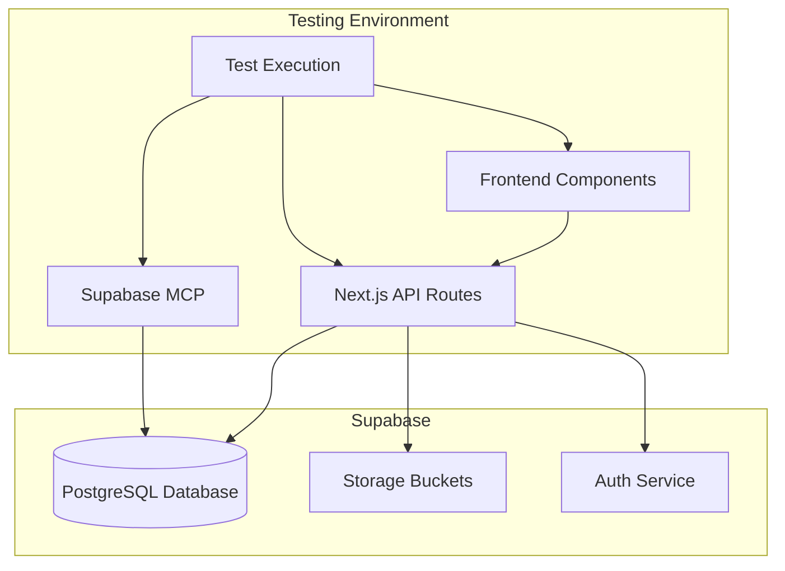

# Design Document

## Overview

This design document outlines a comprehensive testing and validation strategy for the food delivery platform to ensure production readiness. The approach combines automated testing, manual testing, and systematic validation of all features using real data from Supabase. The testing effort will use the Supabase MCP (Model Context Protocol) to interact directly with the database, validate data integrity, and test API endpoints.

### Testing Approach

- **Real Data Testing**: All tests use actual Supabase database, no mocks or stubs
- **MCP Integration**: Leverage Supabase MCP tools for database queries and validation
- **Systematic Coverage**: Test every API endpoint, frontend component, and user flow
- **Role-Based Testing**: Test from perspective of each user role (customer, restaurant owner, driver, admin)
- **End-to-End Validation**: Verify complete user journeys work correctly
- **Performance Monitoring**: Measure response times and identify bottlenecks

### Testing Tools

- **Supabase MCP**: Direct database access and SQL execution
- **Browser DevTools**: Network inspection and frontend debugging
- **Manual Testing**: User interface and experience validation
- **API Testing**: Direct endpoint testing with various scenarios
- **Database Queries**: Validation of data integrity and relationships

## Architecture

### Testing Environment Setup



### Test Data Strategy

1. **Initial State**: Start with seeded database containing sample data
2. **Test Isolation**: Each test scenario uses unique identifiers
3. **Data Cleanup**: Option to reset database between test runs
4. **Real Scenarios**: Use realistic data matching production use cases

## Components and Interfaces

### 1. Database Validation Tests

#### Schema Validation
```typescript
interface SchemaValidation {
  tableName: string;
  expectedColumns: Array<{
    name: string;
    type: string;
    nullable: boolean;
    default?: any;
  }>;
  expectedIndexes: string[];
  expectedConstraints: string[];
}
```

**Test Cases:**
- Verify all tables exist
- Validate column definitions match schema
- Check foreign key relationships
- Verify indexes are created
- Test RLS policies are active

#### Data Integrity Validation
```typescript
interface DataIntegrityCheck {
  checkOrphanedRecords: boolean;
  checkReferentialIntegrity: boolean;
  checkConstraintViolations: boolean;
  checkDataConsistency: boolean;
}
```

**Test Cases:**
- Check for orphaned order_items without orders
- Verify all orders have valid restaurant_id
- Validate loyalty points balance matches transactions
- Check voucher usage counts are accurate

### 2. Authentication Testing

#### Test Scenarios

**Registration Flow:**
```typescript
interface RegistrationTest {
  email: string;
  password: string;
  role: 'customer' | 'restaurant_owner' | 'driver';
  expectedResult: 'success' | 'duplicate_email' | 'validation_error';
}
```

**Test Cases:**
1. Register new customer with valid data
2. Register with duplicate email (should fail)
3. Register with weak password (should fail)
4. Register restaurant owner
5. Register driver
6. Verify JWT tokens are returned
7. Verify user record created in database

**Login Flow:**
```typescript
interface LoginTest {
  email: string;
  password: string;
  expectedResult: 'success' | 'invalid_credentials' | 'account_inactive';
}
```

**Test Cases:**
1. Login with valid credentials
2. Login with invalid password
3. Login with non-existent email
4. Verify JWT token contains correct role
5. Verify refresh token works
6. Test token expiration handling

**Password Reset Flow:**
```typescript
interface PasswordResetTest {
  email: string;
  newPassword: string;
  expectedResult: 'success' | 'invalid_token' | 'expired_token';
}
```

**Test Cases:**
1. Request password reset for valid email
2. Request reset for non-existent email
3. Complete password reset with valid token
4. Attempt reset with expired token
5. Login with new password

### 3. Restaurant Management Testing

#### Restaurant CRUD Operations

**Create Restaurant:**
```typescript
interface RestaurantCreationTest {
  ownerEmail: string;
  restaurantData: {
    name: string;
    cuisineTypes: string[];
    address: string;
    city: string;
    region: string;
    minOrderAmount: number;
  };
  expectedStatus: 'pending' | 'error';
}
```

**Test Cases:**
1. Create restaurant as restaurant owner
2. Verify restaurant status is 'pending'
3. Verify owner_id is correctly set
4. Upload restaurant logo
5. Upload cover image
6. Set opening hours
7. Attempt creation as customer (should fail)

**Restaurant Listing:**
```typescript
interface RestaurantListingTest {
  filters: {
    city?: string;
    region?: string;
    cuisineType?: string;
    status?: string;
  };
  sorting: 'distance' | 'rating' | 'name';
  expectedCount: number;
}
```

**Test Cases:**
1. List all active restaurants
2. Filter by city (Basel, Bern, Luzern, Zürich)
3. Filter by cuisine type
4. Sort by rating
5. Sort by distance (with user coordinates)
6. Search by restaurant name
7. Verify only active restaurants shown to customers
8. Verify pending restaurants shown to admins

**Restaurant Update:**
```typescript
interface RestaurantUpdateTest {
  restaurantId: string;
  updates: Partial<Restaurant>;
  userRole: string;
  expectedResult: 'success' | 'unauthorized' | 'not_found';
}
```

**Test Cases:**
1. Update restaurant as owner
2. Update restaurant as admin
3. Attempt update as different owner (should fail)
4. Update opening hours
5. Update min order amount
6. Verify changes reflected immediately

### 4. Menu Management Testing

#### Menu Item Operations

**Create Menu Item:**
```typescript
interface MenuItemCreationTest {
  restaurantId: string;
  itemData: {
    name: string;
    description: string;
    price: number;
    category: string;
    dietaryTags: string[];
    translations?: Record<string, any>;
  };
  expectedResult: 'success' | 'unauthorized' | 'validation_error';
}
```

**Test Cases:**
1. Create menu item as restaurant owner
2. Add dietary tags (vegan, vegetarian, gluten_free)
3. Add multilingual descriptions
4. Upload item image
5. Add multiple gallery images
6. Attempt creation as different owner (should fail)
7. Verify item appears in restaurant menu

**Menu Listing and Filtering:**
```typescript
interface MenuListingTest {
  restaurantId: string;
  filters: {
    category?: 'meals' | 'drinks' | 'special_deals';
    dietaryTag?: string;
  };
  language: 'en' | 'de' | 'fr' | 'it';
  expectedItems: number;
}
```

**Test Cases:**
1. List all menu items for restaurant
2. Filter by category (meals, drinks, special_deals)
3. Filter by dietary tags
4. Sort by price
5. Verify multilingual content returned
6. Verify out_of_stock items handled correctly

**Menu Item Update:**
```typescript
interface MenuItemUpdateTest {
  itemId: string;
  updates: {
    price?: number;
    quantity?: number;
    status?: string;
  };
  expectedResult: 'success' | 'unauthorized';
}
```

**Test Cases:**
1. Update item price
2. Update item availability
3. Mark item as out_of_stock
4. Update item description
5. Replace item image
6. Verify changes reflected in customer view

### 5. Order Processing Testing

#### Complete Order Flow

**Cart to Order:**
```typescript
interface OrderCreationTest {
  customerId?: string; // Optional for guest orders
  restaurantId: string;
  items: Array<{
    menuItemId: string;
    quantity: number;
    specialInstructions?: string;
  }>;
  deliveryAddress: {
    address: string;
    city: string;
    postalCode: string;
    latitude?: number;
    longitude?: number;
  };
  voucherCode?: string;
  expectedResult: 'success' | 'restaurant_closed' | 'delivery_unavailable';
}
```

**Test Cases:**
1. Create order as authenticated customer
2. Create order as guest user
3. Add multiple items to order
4. Calculate delivery fee based on distance
5. Apply valid voucher code
6. Apply invalid voucher (should fail)
7. Verify order totals calculated correctly
8. Verify loyalty points awarded
9. Verify order number generated
10. Verify restaurant notification sent

**Order Status Transitions:**
```typescript
interface OrderStatusTest {
  orderId: string;
  currentStatus: string;
  newStatus: string;
  userRole: string;
  expectedResult: 'success' | 'invalid_transition' | 'unauthorized';
}
```

**Test Cases:**
1. Restaurant confirms order (new → confirmed)
2. Restaurant marks preparing (confirmed → preparing)
3. Restaurant marks ready (preparing → ready_for_pickup)
4. Driver accepts order (ready_for_pickup → assigned)
5. Driver confirms pickup (assigned → in_transit)
6. Driver confirms delivery (in_transit → delivered)
7. Test invalid transitions (e.g., new → delivered)
8. Verify notifications sent at each transition
9. Verify driver earnings calculated on delivery

**Order Calculations:**
```typescript
interface OrderCalculationTest {
  subtotal: number;
  deliveryFee: number;
  voucherDiscount: number;
  expectedTotal: number;
}
```

**Test Cases:**
1. Calculate subtotal from item prices
2. Calculate delivery fee from distance
3. Apply percentage discount voucher
4. Apply fixed amount discount voucher
5. Verify max discount limit enforced
6. Verify min order amount for voucher
7. Calculate tax if applicable

### 6. Driver Operations Testing

#### Driver Workflow

**Driver Registration:**
```typescript
interface DriverRegistrationTest {
  userId: string;
  driverData: {
    licenseNumber: string;
    vehicleType: string;
    vehiclePlate: string;
    pickupZone: string;
  };
  expectedStatus: 'pending';
}
```

**Test Cases:**
1. Register as driver
2. Upload license documents
3. Upload vehicle documents
4. Verify status is 'pending'
5. Admin approves driver
6. Verify status changes to 'active'

**Available Orders:**
```typescript
interface AvailableOrdersTest {
  driverId: string;
  pickupZone: string;
  expectedOrders: number;
}
```

**Test Cases:**
1. View available orders in pickup zone
2. Verify only ready_for_pickup orders shown
3. Verify orders outside zone not shown
4. Verify inactive drivers don't see orders

**Order Acceptance:**
```typescript
interface OrderAcceptanceTest {
  driverId: string;
  orderId: string;
  expectedResult: 'success' | 'already_assigned' | 'driver_inactive';
}
```

**Test Cases:**
1. Accept available order
2. Verify order assigned to driver
3. Verify customer notified with driver details
4. Attempt to accept already assigned order (should fail)
5. Confirm pickup
6. Confirm delivery
7. Verify earnings calculated

**Driver Earnings:**
```typescript
interface DriverEarningsTest {
  driverId: string;
  dateRange: {
    startDate: string;
    endDate: string;
  };
  expectedEarnings: number;
}
```

**Test Cases:**
1. View total earnings
2. View earnings by date range
3. View completed deliveries count
4. Verify earnings match delivery fees
5. View earnings breakdown by order

### 7. Customer Features Testing

#### Favorites Management

**Test Cases:**
1. Add menu item to favorites
2. Verify favorite saved in database
3. Prevent duplicate favorites
4. View all favorites with restaurant details
5. Remove item from favorites
6. Verify favorite deleted from database

#### Loyalty Points

**Test Cases:**
1. View loyalty points balance
2. View lifetime points earned
3. View transaction history
4. Earn points on order completion
5. Redeem points for 10% discount voucher
6. Redeem points for 20% discount voucher
7. Redeem points for 50% discount voucher
8. Verify insufficient points handled
9. Verify voucher generated correctly
10. Use redeemed voucher in order

#### Order History

**Test Cases:**
1. View all customer orders
2. Filter by order status
3. View order details
4. Verify order items displayed correctly
5. View delivery status
6. Reorder from past order

### 8. Super Admin Dashboard Testing

#### Restaurant Management

**Test Cases:**
1. View all restaurants (pending, active, suspended)
2. Filter by status
3. Filter by region
4. View restaurant details
5. Approve pending restaurant
6. Verify approval notification sent
7. Suspend active restaurant
8. View restaurant activity log
9. View restaurant order statistics

#### Driver Management

**Test Cases:**
1. View all drivers
2. Filter by status
3. View driver details
4. Approve pending driver
5. Verify approval notification sent
6. Suspend active driver
7. View driver activity log
8. View driver delivery statistics
9. View driver earnings

#### Customer Management

**Test Cases:**
1. View all customers
2. Search by name or email
3. View customer details
4. View customer order history
5. View customer loyalty points
6. Suspend customer account
7. View customer activity log

#### Orders Management

**Test Cases:**
1. View all orders
2. Filter by status
3. Filter by region
4. Filter by date range
5. View order details
6. Update order status
7. View order timeline
8. Export orders data

#### Analytics Dashboard

**Test Cases:**
1. View total orders count
2. View total revenue
3. View platform revenue
4. View restaurant earnings
5. View driver earnings
6. View active users count
7. View orders by status
8. View orders by region
9. View average order value
10. Filter analytics by date range
11. Verify calculations are accurate

#### Delivery Settings

**Test Cases:**
1. View current delivery settings
2. Update delivery radius
3. Update base delivery fee
4. Update per-km delivery fee
5. Add new delivery zone
6. Update zone boundaries
7. Verify settings applied to new orders

#### Voucher Management

**Test Cases:**
1. Create percentage discount voucher
2. Create fixed amount discount voucher
3. Set usage limits
4. Set expiration date
5. Set minimum order amount
6. View all vouchers
7. Update voucher
8. Deactivate voucher
9. View voucher usage statistics

### 9. Notification System Testing

#### Email Notifications

**Test Cases:**
1. Order placed → Restaurant owner receives email
2. Order confirmed → Customer receives email
3. Order ready → Driver receives notification
4. Order assigned → Customer receives driver details
5. Order delivered → Customer receives confirmation
6. Restaurant approved → Owner receives welcome email
7. Driver approved → Driver receives welcome email
8. Password reset → User receives reset link
9. Verify emails in correct language
10. Verify email templates render correctly

#### In-App Notifications

**Test Cases:**
1. Create notification record
2. View user notifications
3. Mark notification as read
4. Filter unread notifications
5. Verify notification data structure
6. Delete old notifications

### 10. Search and Filtering Testing

#### Restaurant Search

**Test Cases:**
1. Search by restaurant name (exact match)
2. Search by restaurant name (partial match)
3. Search by cuisine type
4. Filter by city
5. Filter by region
6. Filter by minimum order amount
7. Sort by distance (requires coordinates)
8. Sort by rating
9. Sort by name (alphabetical)
10. Combine multiple filters
11. Verify empty results handled

#### Menu Item Filtering

**Test Cases:**
1. Filter by category (meals, drinks, special_deals)
2. Filter by dietary tags (vegan)
3. Filter by dietary tags (vegetarian)
4. Filter by dietary tags (gluten_free)
5. Sort by price (low to high)
6. Sort by price (high to low)
7. Sort by name
8. Combine filters and sorting
9. Verify out_of_stock items handled

### 11. Voucher System Testing

#### Voucher Validation

**Test Cases:**
1. Apply valid voucher code
2. Apply expired voucher (should fail)
3. Apply voucher below min order (should fail)
4. Apply voucher at usage limit (should fail)
5. Apply inactive voucher (should fail)
6. Apply non-existent voucher (should fail)
7. Verify percentage discount calculated correctly
8. Verify fixed amount discount applied correctly
9. Verify max discount limit enforced
10. Verify usage count incremented

#### Loyalty Voucher Generation

**Test Cases:**
1. Redeem 100 points for 10% discount
2. Redeem 200 points for 20% discount
3. Redeem 500 points for 50% discount
4. Verify voucher code generated
5. Verify voucher has expiration date
6. Verify points deducted from balance
7. Use generated voucher in order

### 12. File Upload Testing

#### Image Upload

**Test Cases:**
1. Upload valid JPEG image
2. Upload valid PNG image
3. Upload valid WebP image
4. Upload invalid file type (should fail)
5. Upload oversized file (should fail)
6. Verify file stored in Supabase Storage
7. Verify public URL returned
8. Verify URL is accessible
9. Update existing image
10. Delete image
11. Upload multiple images (gallery)

#### Storage Bucket Configuration

**Test Cases:**
1. Verify restaurant-images bucket exists
2. Verify bucket permissions correct
3. Verify file size limits enforced
4. Verify file type restrictions enforced

### 13. Multi-language Support Testing

#### Language Detection

**Test Cases:**
1. Detect language from Accept-Language header
2. Use user profile language preference
3. Fall back to English if no preference
4. Override with query parameter

#### Content Localization

**Test Cases:**
1. Return menu items in German
2. Return menu items in French
3. Return menu items in Italian
4. Return menu items in English
5. Fall back to English for missing translations
6. Send notifications in user's language
7. Format prices as Swiss Francs
8. Format dates in European format (DD.MM.YYYY)
9. Format times in 24-hour format

### 14. Frontend Component Testing

#### Restaurant List Component

**Test Cases:**
1. Display restaurants from API
2. Show restaurant logo and cover image
3. Display cuisine types
4. Display distance and delivery time
5. Display minimum order amount
6. Display rating
7. Handle loading state
8. Handle empty results
9. Handle API errors
10. Test pagination

#### Restaurant Menu Component

**Test Cases:**
1. Display menu items from API
2. Show item images
3. Display prices formatted correctly
4. Display dietary tags
5. Show item descriptions
6. Handle category tabs
7. Handle filtering
8. Handle sorting
9. Handle out of stock items
10. Test add to cart functionality

#### Cart Component

**Test Cases:**
1. Display cart items
2. Update item quantities
3. Remove items from cart
4. Calculate subtotal correctly
5. Display delivery fee
6. Apply voucher discount
7. Calculate total correctly
8. Handle empty cart
9. Persist cart state
10. Clear cart after order

#### Order Tracking Component

**Test Cases:**
1. Display order status
2. Show order timeline
3. Display restaurant details
4. Display delivery address
5. Show driver details (when assigned)
6. Update status in real-time
7. Display order items
8. Show order totals
9. Handle different order statuses

#### Driver Orders Component

**Test Cases:**
1. Display available orders
2. Show order details
3. Accept order button
4. Confirm pickup button
5. Confirm delivery button
6. Display earnings
7. Show delivery address
8. Handle order status updates

#### Admin Dashboard Components

**Test Cases:**
1. Display analytics charts
2. Show restaurant list with filters
3. Show driver list with filters
4. Show customer list
5. Show orders list with filters
6. Display activity logs
7. Handle approval actions
8. Show voucher management
9. Display delivery settings
10. Handle data updates

### 15. Performance Testing

#### API Response Times

**Test Cases:**
1. Measure GET /api/restaurants response time
2. Measure GET /api/restaurants/[id]/menu response time
3. Measure POST /api/orders response time
4. Measure GET /api/admin/analytics response time
5. Identify slow endpoints (>500ms)
6. Profile database queries
7. Identify missing indexes
8. Test with realistic data volumes

#### Database Query Optimization

**Test Cases:**
1. Analyze query execution plans
2. Identify full table scans
3. Verify indexes are used
4. Optimize slow queries
5. Test pagination performance
6. Test filtering performance
7. Test sorting performance

#### Frontend Performance

**Test Cases:**
1. Measure page load times
2. Measure time to interactive
3. Test image loading performance
4. Test component render times
5. Identify performance bottlenecks
6. Test with slow network conditions

### 16. Error Handling Testing

#### Validation Errors

**Test Cases:**
1. Submit invalid email format
2. Submit weak password
3. Submit negative price
4. Submit invalid phone number
5. Submit missing required fields
6. Verify error messages are clear
7. Verify error codes are correct

#### Authorization Errors

**Test Cases:**
1. Access endpoint without authentication
2. Access resource of different user
3. Perform action without permission
4. Use expired JWT token
5. Use invalid JWT token
6. Verify 401/403 responses

#### Resource Not Found

**Test Cases:**
1. Request non-existent restaurant
2. Request non-existent order
3. Request non-existent menu item
4. Verify 404 responses
5. Verify error messages

#### Server Errors

**Test Cases:**
1. Simulate database connection failure
2. Simulate storage service failure
3. Verify 500 responses
4. Verify errors are logged
5. Verify sensitive data not exposed

#### Rate Limiting

**Test Cases:**
1. Make rapid requests to endpoint
2. Verify rate limit enforced
3. Verify 429 response
4. Verify retry-after header
5. Test different limits for different endpoints

### 17. Security Testing

#### SQL Injection Prevention

**Test Cases:**
1. Attempt SQL injection in search query
2. Attempt SQL injection in filters
3. Verify parameterized queries used
4. Verify input sanitization

#### XSS Prevention

**Test Cases:**
1. Submit script tags in text fields
2. Submit malicious HTML in descriptions
3. Verify input sanitization
4. Verify output encoding

#### Authentication Security

**Test Cases:**
1. Verify passwords are hashed
2. Verify JWT tokens are signed
3. Verify token expiration enforced
4. Verify refresh token rotation
5. Test password strength requirements

#### File Upload Security

**Test Cases:**
1. Attempt to upload executable file
2. Attempt to upload oversized file
3. Verify file type validation
4. Verify file size validation
5. Verify uploaded files are scanned

### 18. Data Integrity Testing

#### Referential Integrity

**Test Cases:**
1. Verify foreign key constraints
2. Test cascade deletes
3. Check for orphaned records
4. Verify transaction atomicity

#### Data Consistency

**Test Cases:**
1. Verify order totals match item prices
2. Verify loyalty points balance matches transactions
3. Verify voucher usage counts accurate
4. Verify driver earnings match deliveries
5. Test concurrent updates

#### Audit Trail

**Test Cases:**
1. Verify activity logs created
2. Verify timestamps accurate
3. Verify user actions logged
4. Verify admin actions logged

### 19. Integration Testing

#### End-to-End Customer Journey

**Test Scenario:**
1. Customer registers account
2. Customer browses restaurants
3. Customer views restaurant menu
4. Customer adds items to cart
5. Customer applies voucher
6. Customer places order
7. Customer receives confirmation
8. Restaurant confirms order
9. Restaurant prepares order
10. Driver accepts order
11. Driver picks up order
12. Driver delivers order
13. Customer receives delivery
14. Customer earns loyalty points

**Validation Points:**
- All API calls succeed
- Data persisted correctly
- Notifications sent
- Status transitions valid
- Calculations accurate

#### End-to-End Restaurant Journey

**Test Scenario:**
1. Restaurant owner registers
2. Owner creates restaurant profile
3. Owner uploads images
4. Admin approves restaurant
5. Owner adds menu items
6. Owner receives order
7. Owner confirms order
8. Owner marks preparing
9. Owner marks ready for pickup
10. Order assigned to driver
11. Order delivered
12. Owner views earnings

**Validation Points:**
- All operations succeed
- Permissions enforced
- Notifications received
- Data accurate

#### End-to-End Driver Journey

**Test Scenario:**
1. Driver registers
2. Driver uploads documents
3. Admin approves driver
4. Driver sets pickup zone
5. Driver views available orders
6. Driver accepts order
7. Driver confirms pickup
8. Driver confirms delivery
9. Driver views earnings

**Validation Points:**
- All operations succeed
- Order assignment works
- Earnings calculated
- Status updates correct

### 20. Production Readiness Checklist

#### Environment Configuration

**Validation:**
- [ ] All environment variables set
- [ ] Supabase project configured
- [ ] Database migrations applied
- [ ] Storage buckets created
- [ ] RLS policies enabled
- [ ] API keys secured

#### Database Preparation

**Validation:**
- [ ] Schema matches design
- [ ] Indexes created
- [ ] Seed data loaded
- [ ] Backups configured
- [ ] Connection pooling set

#### Monitoring Setup

**Validation:**
- [ ] Error tracking configured
- [ ] Logging enabled
- [ ] Performance monitoring active
- [ ] Alerts configured
- [ ] Dashboard accessible

#### Security Audit

**Validation:**
- [ ] Authentication tested
- [ ] Authorization tested
- [ ] Input validation verified
- [ ] SQL injection prevented
- [ ] XSS prevented
- [ ] File upload secured
- [ ] Rate limiting active

#### Performance Benchmarks

**Validation:**
- [ ] API response times acceptable
- [ ] Database queries optimized
- [ ] Frontend load times acceptable
- [ ] Image loading optimized
- [ ] Pagination working

#### Documentation

**Validation:**
- [ ] API documentation complete
- [ ] Deployment guide written
- [ ] Troubleshooting guide created
- [ ] Environment setup documented
- [ ] Testing procedures documented

## Testing Execution Strategy

### Phase 1: Database and Infrastructure (Day 1)
1. Validate database schema
2. Check indexes and constraints
3. Test RLS policies
4. Verify storage buckets
5. Test environment configuration

### Phase 2: Authentication and Authorization (Day 1)
1. Test registration flow
2. Test login flow
3. Test password reset
4. Test token refresh
5. Test role-based access

### Phase 3: Core Features (Days 2-3)
1. Test restaurant management
2. Test menu management
3. Test order processing
4. Test driver operations
5. Test customer features

### Phase 4: Admin Features (Day 4)
1. Test admin dashboards
2. Test approval workflows
3. Test analytics
4. Test settings management
5. Test voucher management

### Phase 5: Integration and Frontend (Day 5)
1. Test end-to-end flows
2. Test frontend components
3. Test notifications
4. Test multi-language support
5. Test file uploads

### Phase 6: Performance and Security (Day 6)
1. Performance testing
2. Security testing
3. Error handling testing
4. Data integrity testing
5. Load testing

### Phase 7: Production Readiness (Day 7)
1. Final validation
2. Documentation review
3. Deployment preparation
4. Monitoring setup
5. Go/no-go decision

## Success Criteria

The system is considered production-ready when:

1. **All Critical Tests Pass**: 100% of critical functionality tests pass
2. **Performance Acceptable**: API response times under 500ms for 95% of requests
3. **Security Validated**: No critical security vulnerabilities found
4. **Data Integrity Confirmed**: All data consistency checks pass
5. **Frontend Functional**: All components work with real backend data
6. **Documentation Complete**: All deployment and operational docs ready
7. **Monitoring Active**: Error tracking and logging functional
8. **Backups Configured**: Database backups running automatically

## Risk Mitigation

### Identified Risks

1. **Data Loss**: Mitigate with database backups and transaction rollback
2. **Performance Issues**: Mitigate with query optimization and caching
3. **Security Vulnerabilities**: Mitigate with security testing and code review
4. **Integration Failures**: Mitigate with comprehensive integration tests
5. **User Experience Issues**: Mitigate with manual testing and user feedback

### Rollback Plan

If critical issues are found:
1. Document the issue with reproduction steps
2. Assess severity and impact
3. Fix issue in development environment
4. Re-test affected functionality
5. Validate fix doesn't break other features
6. Deploy fix to production

## Conclusion

This comprehensive testing and validation strategy ensures the food delivery platform is thoroughly tested with real data before production deployment. By systematically testing every feature, API endpoint, and frontend component, we can identify and fix issues early, ensuring a smooth launch and positive user experience.
