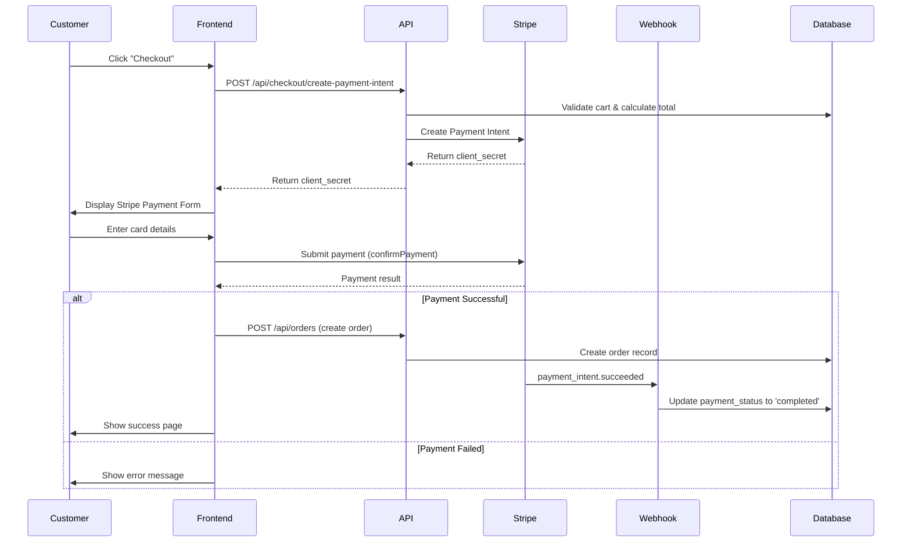

# Design Document: Stripe Payment Integration

## Overview

This design document outlines the implementation of Stripe payment processing for the food delivery platform. The solution integrates Stripe's Payment Intents API to handle secure card payments, implements webhook handlers for asynchronous payment confirmations, and creates a seamless checkout flow that transitions from cart to payment to order confirmation.

The implementation uses Stripe's test environment with the provided sandbox credentials and follows PCI compliance best practices by never storing sensitive card data on our servers.

### Key Technologies
- **Stripe API v2023-10-16**: Payment processing and webhooks
- **Stripe.js & Elements**: Client-side secure payment form
- **Next.js API Routes**: Backend payment intent creation and webhook handling
- **Supabase**: Order and payment status persistence

## Architecture

### High-Level Flow



### Component Architecture

```
┌─────────────────────────────────────────────────────────────┐
│                     Frontend Layer                           │
├─────────────────────────────────────────────────────────────┤
│  • CheckoutPage (app/checkout/page.tsx)                     │
│  • StripePaymentForm (components/stripe-payment-form.tsx)   │
│  • PaymentSuccessView (existing)                            │
│  • PaymentErrorView (existing)                              │
└─────────────────────────────────────────────────────────────┘
                            ↓
┌─────────────────────────────────────────────────────────────┐
│                      API Layer                               │
├─────────────────────────────────────────────────────────────┤
│  • POST /api/checkout/create-payment-intent                 │
│  • POST /api/checkout/webhooks                              │
│  • POST /api/orders (enhanced with payment)                 │
└─────────────────────────────────────────────────────────────┘
                            ↓
┌─────────────────────────────────────────────────────────────┐
│                   Service Layer                              │
├─────────────────────────────────────────────────────────────┤
│  • lib/stripe/client.ts (Stripe initialization)             │
│  • lib/stripe/payment-intent.ts (Payment Intent logic)      │
│  • lib/stripe/webhook.ts (Webhook verification)             │
└─────────────────────────────────────────────────────────────┘
                            ↓
┌─────────────────────────────────────────────────────────────┐
│                   Data Layer                                 │
├─────────────────────────────────────────────────────────────┤
│  • Supabase orders table (payment_status, payment_reference)│
│  • Supabase order_items table                               │
└─────────────────────────────────────────────────────────────┘
```

## Components and Interfaces

### 1. Environment Configuration

**File**: `.env` (add to existing)

```env
# Stripe Configuration
STRIPE_PUBLISHABLE_KEY=pk_test_your_publishable_key_here
STRIPE_SECRET_KEY=sk_test_your_secret_key_here
STRIPE_WEBHOOK_SECRET=whsec_xxx  # Will be generated when webhook endpoint is registered
```

**File**: `next.config.mjs` (update to expose public key)

```javascript
env: {
  NEXT_PUBLIC_STRIPE_PUBLISHABLE_KEY: process.env.STRIPE_PUBLISHABLE_KEY,
}
```

### 2. Stripe Client Initialization

**File**: `lib/stripe/client.ts`

```typescript
import Stripe from 'stripe';

if (!process.env.STRIPE_SECRET_KEY) {
  throw new Error('STRIPE_SECRET_KEY is not defined');
}

export const stripe = new Stripe(process.env.STRIPE_SECRET_KEY, {
  apiVersion: '2023-10-16',
  typescript: true,
});

export const STRIPE_PUBLISHABLE_KEY = process.env.NEXT_PUBLIC_STRIPE_PUBLISHABLE_KEY;
```

### 3. Payment Intent Service

**File**: `lib/stripe/payment-intent.ts`

```typescript
import { stripe } from './client';
import Stripe from 'stripe';

export interface CreatePaymentIntentParams {
  amount: number; // in cents
  currency: string;
  orderId?: string;
  customerId?: string;
  customerEmail?: string;
  metadata?: Record<string, string>;
}

export interface PaymentIntentResult {
  clientSecret: string;
  paymentIntentId: string;
}

export async function createPaymentIntent(
  params: CreatePaymentIntentParams
): Promise<PaymentIntentResult> {
  const paymentIntent = await stripe.paymentIntents.create({
    amount: params.amount,
    currency: params.currency,
    customer_email: params.customerEmail,
    metadata: {
      orderId: params.orderId || '',
      customerId: params.customerId || '',
      ...params.metadata,
    },
    automatic_payment_methods: {
      enabled: true,
    },
  });

  return {
    clientSecret: paymentIntent.client_secret!,
    paymentIntentId: paymentIntent.id,
  };
}

export async function retrievePaymentIntent(
  paymentIntentId: string
): Promise<Stripe.PaymentIntent> {
  return await stripe.paymentIntents.retrieve(paymentIntentId);
}
```

### 4. Webhook Handler Service

**File**: `lib/stripe/webhook.ts`

```typescript
import { stripe } from './client';
import Stripe from 'stripe';

export async function constructWebhookEvent(
  payload: string | Buffer,
  signature: string
): Promise<Stripe.Event> {
  const webhookSecret = process.env.STRIPE_WEBHOOK_SECRET;
  
  if (!webhookSecret) {
    throw new Error('STRIPE_WEBHOOK_SECRET is not configured');
  }

  try {
    return stripe.webhooks.constructEvent(payload, signature, webhookSecret);
  } catch (err: any) {
    throw new Error(`Webhook signature verification failed: ${err.message}`);
  }
}

export function isTestModeEvent(event: Stripe.Event): boolean {
  return event.livemode === false;
}
```

### 5. API Route: Create Payment Intent

**File**: `app/api/checkout/create-payment-intent/route.ts`

```typescript
import { NextRequest, NextResponse } from 'next/server';
import { createPaymentIntent } from '@/lib/stripe/payment-intent';
import { optionalAuth } from '@/lib/middleware/auth';
import { z } from 'zod';

const createPaymentIntentSchema = z.object({
  amount: z.number().positive(),
  currency: z.string().default('chf'),
  orderId: z.string().optional(),
  customerEmail: z.string().email().optional(),
});

export async function POST(req: NextRequest) {
  try {
    const user = await optionalAuth(req);
    const body = await req.json();
    const validatedData = createPaymentIntentSchema.parse(body);

    // Convert amount to cents (Stripe requires smallest currency unit)
    const amountInCents = Math.round(validatedData.amount * 100);

    const result = await createPaymentIntent({
      amount: amountInCents,
      currency: validatedData.currency.toLowerCase(),
      orderId: validatedData.orderId,
      customerId: user?.id,
      customerEmail: validatedData.customerEmail || user?.email,
      metadata: {
        environment: 'test',
      },
    });

    return NextResponse.json({
      clientSecret: result.clientSecret,
      paymentIntentId: result.paymentIntentId,
    });
  } catch (error: any) {
    console.error('Payment intent creation error:', error);

    if (error.name === 'ZodError') {
      return NextResponse.json(
        {
          error: {
            code: 'VALIDATION_ERROR',
            message: 'Invalid request data',
            details: error.errors,
          },
        },
        { status: 400 }
      );
    }

    return NextResponse.json(
      {
        error: {
          code: 'PAYMENT_INTENT_FAILED',
          message: error.message || 'Failed to create payment intent',
        },
      },
      { status: 500 }
    );
  }
}
```

### 6. API Route: Webhook Handler

**File**: `app/api/checkout/webhooks/route.ts`

```typescript
import { NextRequest, NextResponse } from 'next/server';
import { constructWebhookEvent } from '@/lib/stripe/webhook';
import { db } from '@/lib/supabase/database';
import Stripe from 'stripe';

export async function POST(req: NextRequest) {
  const payload = await req.text();
  const signature = req.headers.get('stripe-signature');

  if (!signature) {
    return NextResponse.json(
      { error: 'Missing stripe-signature header' },
      { status: 400 }
    );
  }

  try {
    const event = await constructWebhookEvent(payload, signature);

    // Handle different event types
    switch (event.type) {
      case 'payment_intent.succeeded':
        await handlePaymentIntentSucceeded(event.data.object as Stripe.PaymentIntent);
        break;

      case 'payment_intent.payment_failed':
        await handlePaymentIntentFailed(event.data.object as Stripe.PaymentIntent);
        break;

      case 'payment_intent.canceled':
        await handlePaymentIntentCanceled(event.data.object as Stripe.PaymentIntent);
        break;

      default:
        console.log(`Unhandled event type: ${event.type}`);
    }

    return NextResponse.json({ received: true });
  } catch (error: any) {
    console.error('Webhook error:', error);
    return NextResponse.json(
      { error: error.message },
      { status: 400 }
    );
  }
}

async function handlePaymentIntentSucceeded(paymentIntent: Stripe.PaymentIntent) {
  const orderId = paymentIntent.metadata.orderId;

  if (!orderId) {
    console.error('No orderId in payment intent metadata');
    return;
  }

  // Update order payment status
  const { error } = await db
    .from('orders')
    .update({
      payment_status: 'completed',
      payment_reference: paymentIntent.id,
      payment_method: 'stripe',
      status: 'confirmed',
      updated_at: new Date().toISOString(),
    })
    .eq('id', orderId);

  if (error) {
    console.error('Failed to update order payment status:', error);
  } else {
    console.log(`Payment succeeded for order ${orderId}`);
  }
}

async function handlePaymentIntentFailed(paymentIntent: Stripe.PaymentIntent) {
  const orderId = paymentIntent.metadata.orderId;

  if (!orderId) {
    console.error('No orderId in payment intent metadata');
    return;
  }

  const { error } = await db
    .from('orders')
    .update({
      payment_status: 'failed',
      payment_reference: paymentIntent.id,
      updated_at: new Date().toISOString(),
    })
    .eq('id', orderId);

  if (error) {
    console.error('Failed to update order payment status:', error);
  } else {
    console.log(`Payment failed for order ${orderId}`);
  }
}

async function handlePaymentIntentCanceled(paymentIntent: Stripe.PaymentIntent) {
  const orderId = paymentIntent.metadata.orderId;

  if (!orderId) {
    return;
  }

  await db
    .from('orders')
    .update({
      payment_status: 'failed',
      status: 'cancelled',
      updated_at: new Date().toISOString(),
    })
    .eq('id', orderId);
}

// Disable body parsing for webhook routes
export const config = {
  api: {
    bodyParser: false,
  },
};
```

### 7. Frontend: Stripe Payment Form Component

**File**: `components/stripe-payment-form.tsx`

```typescript
'use client';

import { useState, useEffect } from 'react';
import { loadStripe, StripeElementsOptions } from '@stripe/stripe-js';
import {
  Elements,
  PaymentElement,
  useStripe,
  useElements,
} from '@stripe/react-stripe-js';

const stripePromise = loadStripe(
  process.env.NEXT_PUBLIC_STRIPE_PUBLISHABLE_KEY!
);

interface PaymentFormProps {
  clientSecret: string;
  amount: number;
  onSuccess: () => void;
  onError: (error: string) => void;
}

function CheckoutForm({ amount, onSuccess, onError }: Omit<PaymentFormProps, 'clientSecret'>) {
  const stripe = useStripe();
  const elements = useElements();
  const [isProcessing, setIsProcessing] = useState(false);
  const [errorMessage, setErrorMessage] = useState<string | null>(null);

  const handleSubmit = async (e: React.FormEvent) => {
    e.preventDefault();

    if (!stripe || !elements) {
      return;
    }

    setIsProcessing(true);
    setErrorMessage(null);

    try {
      const { error } = await stripe.confirmPayment({
        elements,
        confirmParams: {
          return_url: `${window.location.origin}/checkout/success`,
        },
        redirect: 'if_required',
      });

      if (error) {
        setErrorMessage(error.message || 'Payment failed');
        onError(error.message || 'Payment failed');
      } else {
        onSuccess();
      }
    } catch (err: any) {
      setErrorMessage(err.message || 'An unexpected error occurred');
      onError(err.message || 'An unexpected error occurred');
    } finally {
      setIsProcessing(false);
    }
  };

  return (
    <form onSubmit={handleSubmit} className="space-y-6">
      <div className="bg-white p-6 rounded-lg shadow">
        <PaymentElement />
      </div>

      {errorMessage && (
        <div className="bg-red-50 border border-red-200 text-red-700 px-4 py-3 rounded">
          {errorMessage}
        </div>
      )}

      <button
        type="submit"
        disabled={!stripe || isProcessing}
        className="w-full bg-green-600 text-white py-3 px-6 rounded-lg font-bold hover:bg-green-700 disabled:bg-gray-400 disabled:cursor-not-allowed"
      >
        {isProcessing ? 'Processing...' : `Pay Fr. ${amount.toFixed(2)}`}
      </button>

      <div className="text-center text-sm text-gray-500">
        <span className="inline-block bg-yellow-100 text-yellow-800 px-2 py-1 rounded">
          🧪 Test Mode
        </span>
      </div>
    </form>
  );
}

export function StripePaymentForm({ clientSecret, amount, onSuccess, onError }: PaymentFormProps) {
  const options: StripeElementsOptions = {
    clientSecret,
    appearance: {
      theme: 'stripe',
      variables: {
        colorPrimary: '#16a34a',
      },
    },
  };

  return (
    <Elements stripe={stripePromise} options={options}>
      <CheckoutForm amount={amount} onSuccess={onSuccess} onError={onError} />
    </Elements>
  );
}
```

### 8. Frontend: Checkout Page

**File**: `app/checkout/page.tsx`

```typescript
'use client';

import { useState, useEffect } from 'react';
import { useRouter } from 'next/navigation';
import { useCart } from '@/lib/cart-context';
import { StripePaymentForm } from '@/components/stripe-payment-form';

export default function CheckoutPage() {
  const router = useRouter();
  const { items, getTotalPrice, clearCart } = useCart();
  const [clientSecret, setClientSecret] = useState<string | null>(null);
  const [orderId, setOrderId] = useState<string | null>(null);
  const [loading, setLoading] = useState(true);
  const [error, setError] = useState<string | null>(null);

  const subtotal = getTotalPrice();
  const deliveryFee = 6.0;
  const total = subtotal + deliveryFee;

  useEffect(() => {
    if (items.length === 0) {
      router.push('/');
      return;
    }

    createPaymentIntent();
  }, []);

  const createPaymentIntent = async () => {
    try {
      setLoading(true);
      
      // First create the order
      const orderResponse = await fetch('/api/orders', {
        method: 'POST',
        headers: { 'Content-Type': 'application/json' },
        body: JSON.stringify({
          restaurantId: items[0].restaurantId,
          items: items.map(item => ({
            menuItemId: item.menuItemId,
            quantity: item.quantity,
          })),
          deliveryAddress: 'Placeholder', // Get from form
          deliveryCity: 'Basel',
          deliveryPostalCode: '4000',
          scheduledDeliveryTime: new Date(Date.now() + 3600000).toISOString(),
        }),
      });

      if (!orderResponse.ok) {
        throw new Error('Failed to create order');
      }

      const orderData = await orderResponse.json();
      setOrderId(orderData.order.id);

      // Then create payment intent
      const paymentResponse = await fetch('/api/checkout/create-payment-intent', {
        method: 'POST',
        headers: { 'Content-Type': 'application/json' },
        body: JSON.stringify({
          amount: total,
          currency: 'chf',
          orderId: orderData.order.id,
        }),
      });

      if (!paymentResponse.ok) {
        throw new Error('Failed to create payment intent');
      }

      const paymentData = await paymentResponse.json();
      setClientSecret(paymentData.clientSecret);
    } catch (err: any) {
      setError(err.message);
    } finally {
      setLoading(false);
    }
  };

  const handlePaymentSuccess = () => {
    clearCart();
    router.push(`/checkout/success?orderId=${orderId}`);
  };

  const handlePaymentError = (errorMessage: string) => {
    setError(errorMessage);
  };

  if (loading) {
    return <div className="container mx-auto p-8">Loading...</div>;
  }

  if (error) {
    return (
      <div className="container mx-auto p-8">
        <div className="bg-red-50 border border-red-200 text-red-700 px-4 py-3 rounded">
          {error}
        </div>
      </div>
    );
  }

  return (
    <div className="container mx-auto p-8 max-w-2xl">
      <h1 className="text-3xl font-bold mb-8">Checkout</h1>

      <div className="bg-gray-50 p-6 rounded-lg mb-8">
        <h2 className="text-xl font-bold mb-4">Order Summary</h2>
        <div className="space-y-2">
          <div className="flex justify-between">
            <span>Subtotal</span>
            <span>Fr. {subtotal.toFixed(2)}</span>
          </div>
          <div className="flex justify-between">
            <span>Delivery Fee</span>
            <span>Fr. {deliveryFee.toFixed(2)}</span>
          </div>
          <div className="border-t pt-2 flex justify-between font-bold">
            <span>Total</span>
            <span>Fr. {total.toFixed(2)}</span>
          </div>
        </div>
      </div>

      {clientSecret && (
        <StripePaymentForm
          clientSecret={clientSecret}
          amount={total}
          onSuccess={handlePaymentSuccess}
          onError={handlePaymentError}
        />
      )}
    </div>
  );
}
```

## Data Models

### Updated Order Schema

The existing `orders` table already has the necessary fields:
- `payment_status`: 'pending' | 'completed' | 'failed' | 'refunded'
- `payment_method`: string (will store 'stripe')
- `payment_reference`: string (will store Stripe Payment Intent ID)

No database migrations are required.

### Payment Intent Metadata Structure

```typescript
{
  orderId: string;        // Our internal order ID
  customerId?: string;    // Our internal customer ID
  environment: 'test';    // Indicates test mode
}
```

## Error Handling

### Error Types and Responses

1. **Payment Intent Creation Errors**
   - Invalid amount
   - Missing required fields
   - Stripe API errors
   - Response: 400/500 with error code and message

2. **Payment Confirmation Errors**
   - Card declined
   - Insufficient funds
   - Authentication required (3D Secure)
   - Network errors
   - Response: Display user-friendly message, allow retry

3. **Webhook Processing Errors**
   - Invalid signature
   - Missing webhook secret
   - Database update failures
   - Response: Log error, return 200 to prevent retries

4. **Order Creation Errors**
   - Invalid cart items
   - Restaurant closed
   - Delivery address out of range
   - Response: 400/422 with specific error message

### Error Recovery Strategies

- **Payment Failures**: Allow customer to retry with same or different card
- **Webhook Failures**: Stripe automatically retries failed webhooks
- **Order Creation After Payment**: Log critical error, notify admin, manual reconciliation
- **Network Timeouts**: Implement payment status check endpoint

## Testing Strategy

### Test Cards (Stripe Test Mode)

```
Success: 4242 4242 4242 4242
Decline: 4000 0000 0000 0002
3D Secure: 4000 0027 6000 3184
Insufficient Funds: 4000 0000 0000 9995
```

### Test Scenarios

1. **Successful Payment Flow**
   - Add items to cart
   - Proceed to checkout
   - Enter test card 4242 4242 4242 4242
   - Verify order created with payment_status='completed'
   - Verify webhook updates order status

2. **Failed Payment Flow**
   - Use declined card 4000 0000 0000 0002
   - Verify error message displayed
   - Verify order remains in 'pending' state
   - Verify customer can retry

3. **3D Secure Authentication**
   - Use 3D Secure card 4000 0027 6000 3184
   - Complete authentication challenge
   - Verify payment succeeds after authentication

4. **Webhook Processing**
   - Use Stripe CLI to forward webhooks locally
   - Trigger payment_intent.succeeded event
   - Verify database updated correctly

5. **Guest Checkout**
   - Checkout without authentication
   - Verify payment and order creation work
   - Verify order associated with guest email

### Integration Testing

```bash
# Install Stripe CLI
brew install stripe/stripe-cli/stripe

# Login to Stripe
stripe login

# Forward webhooks to local development
stripe listen --forward-to localhost:3000/api/checkout/webhooks

# Trigger test events
stripe trigger payment_intent.succeeded
stripe trigger payment_intent.payment_failed
```

### Unit Tests

- Payment intent creation with various amounts
- Webhook signature verification
- Order total calculation with delivery fees
- Voucher discount application
- Error handling for invalid inputs

## Security Considerations

1. **PCI Compliance**
   - Never store card details in our database
   - Use Stripe.js to tokenize card data client-side
   - Only store Stripe Payment Intent IDs

2. **Webhook Security**
   - Verify webhook signatures using Stripe's library
   - Reject requests with invalid signatures
   - Use HTTPS in production

3. **API Key Management**
   - Store keys in environment variables
   - Never commit keys to version control
   - Use different keys for test and production
   - Rotate keys periodically

4. **Amount Validation**
   - Validate amounts server-side
   - Prevent amount manipulation from client
   - Verify order total matches payment intent amount

5. **Idempotency**
   - Use Stripe's idempotency keys for payment intents
   - Prevent duplicate charges
   - Handle webhook event deduplication

## Deployment Considerations

### Environment Variables

Production environment must have:
- `STRIPE_PUBLISHABLE_KEY` (live key starting with pk_live_)
- `STRIPE_SECRET_KEY` (live key starting with sk_live_)
- `STRIPE_WEBHOOK_SECRET` (from Stripe Dashboard)

### Webhook Registration

1. Register webhook endpoint in Stripe Dashboard
2. Set URL: `https://yourdomain.com/api/checkout/webhooks`
3. Select events: `payment_intent.succeeded`, `payment_intent.payment_failed`, `payment_intent.canceled`
4. Copy webhook signing secret to environment variables

### Monitoring

- Log all payment intent creations
- Log all webhook events
- Set up alerts for payment failures
- Monitor webhook delivery success rate
- Track payment success/failure rates

## Future Enhancements

1. **Multiple Payment Methods**
   - Apple Pay / Google Pay
   - SEPA Direct Debit
   - TWINT (Swiss payment method)

2. **Saved Payment Methods**
   - Store customer payment methods in Stripe
   - One-click checkout for returning customers

3. **Refunds**
   - Implement refund API endpoint
   - Admin interface for processing refunds

4. **Payment Analytics**
   - Dashboard for payment metrics
   - Revenue tracking
   - Failed payment analysis

5. **Subscription Support**
   - Recurring payments for premium features
   - Subscription management
